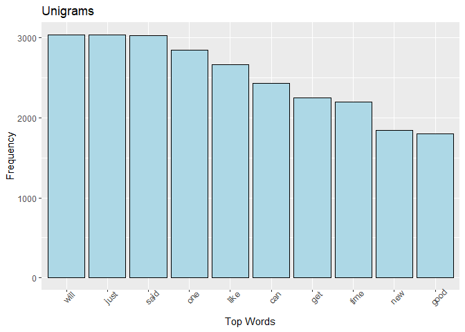
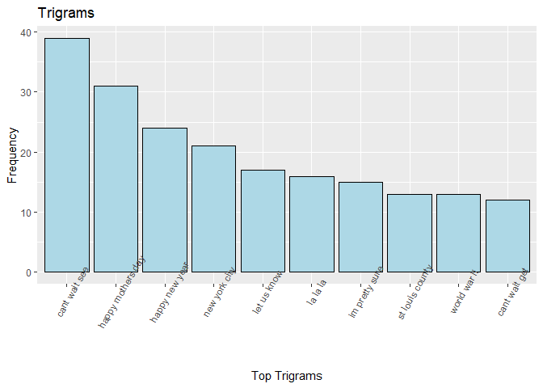

## Overview
This is the Milestone Report for the NLP text prediction project. This milestone shows the loading, sampling, cleaning, and explorartory analysis of the data. Data is from SwiftKey.  [Download](https://d396qusza40orc.cloudfront.net/dsscapstone/dataset/Coursera-SwiftKey.zip)

To reproduce, make sure you unzip the twitter, blog, and news text data files (for your corresponding language) into a "/data" subfolder in your working directory. 

### Libraries

```r
library(tm)
library(readr)
library(dplyr)
library(stringi)
library(RWeka)
library(ggplot2)
```

### Loading the Data

```r
con <- file("./data/en_US.twitter.txt", open="rb")
twitter <- read_lines(con, skip_empty_rows = T)
close(con)

con <- file("./data/en_US.blogs.txt", "rb")
blogs <- read_lines(con, skip_empty_rows = T)
close(con)

con <- file("./data/en_US.news.txt", open="rb")
news <- read_lines(con, skip_empty_rows = T)
close(con)
```

### Gather Details about the data

```r
len <- sapply(list(twitter,blogs,news), length) #lines for each file
words <- sapply(list(twitter,blogs,news), stri_stats_latex) #total words

t_char <- range(sapply(twitter, nchar)) #range of number of characters for each line
b_char <- range(sapply(blogs, nchar)) #range of number of characters for each line
n_char <- range(sapply(news, nchar)) #range of number of characters for each line
min_char <- c(t_char[1],b_char[1], n_char[1]) 
max_char <- c(t_char[2],b_char[2], n_char[2])
total_words <- c(words[4,1][[1]],words[4,2][[1]],words[4,3][[1]]) #total words for each file
```

### Data Statistics
From the previously calculated details we create a DF showing the lines, words, min and max characters per line for each file. 

```r
data.frame(lines = len, total_words, min_char, max_char, row.names = c("twitter","blogs","news"))
```

```
          lines total_words min_char max_char
twitter 2360148    30451128        2      140
blogs    899288    37570839        1    40833
news    1010242    34494539        1    11384
```

### Sampling
Due to the large size of each file, we are going to randomly sample lines to create a subset of the data for future calculations. This will save processing power and time. We will only randomly chose 1% of the total data as our sample.

```r
set.seed(12345)
tw_samp <- sample(twitter, len[1]*0.01)
bl_samp <- sample(blogs, len[2]*0.01)
new_samp <- sample(news, len[3]*0.01)
corpus <- c(tw_samp, bl_samp, new_samp)
```

### Cleaning the data
We now need to remove the profanity and also any characters that are not english characters and punctuation.

First, let's load a list of profanity words we are going to filter out of our data. This file was compiled by other users on the internet. Download here: [Profanity List Link](http://gist.githubusercontent.com/ryanlewis/a37739d710ccdb4b406d/raw/3b70dd644cec678ddc43da88d30034add22897ef/google_twunter_lol). Place the file into the data sub-folder.

```r
profanity <- read.csv("./data/profanity.txt", header = F, sep="\n")
```
Now let's do the rest of the cleaning

```r
corpus <- VCorpus(VectorSource(corpus)) #creating our corpus
delete <- content_transformer(function(x, pattern) gsub(pattern, " ", x)) #create a custom delete function

corpus <- tm_map(corpus, delete, "(f|ht)tp(s?)://(.*)[.][a-z]+") # removes https
corpus <- tm_map(corpus, delete, "@[^\\s]+") #removes extra URL syntax
corpus <- tm_map(corpus, removePunctuation) #removes any punctuation
corpus <- tm_map(corpus, removeNumbers) #removes numbers
corpus <- tm_map(corpus, content_transformer(tolower)) #lowercase all words
corpus <- tm_map(corpus, removeWords, stopwords("english")) #remove stop words
corpus <- tm_map(corpus, removeWords, profanity[,1])  #remove profanity 
corpus <- tm_map(corpus, stripWhitespace) #remove white space
corpus <- tm_map(corpus, PlainTextDocument) #convert to plain text
```

### Exploratory Analysis
With our cleaned sample data, let's now see what are the most frequent words / combination of words. 

#### Unigrams

```r
tokenize1 <- function(x) NGramTokenizer(x, Weka_control(min = 1, max = 1))
uniDTM <- DocumentTermMatrix(corpus, control = list(tokenize = tokenize1))
unifreq <- findFreqTerms(uniDTM,lowfreq = 500)
unicols <- colSums(as.matrix(uniDTM[,unifreq]))
unidf <-data.frame(Word=names(unicols),frequency=unicols, row.names = NULL)
unigram <-unidf[order(-unidf$frequency)[1:10],] 
```
<!-- -->

#### Bigrams
Let's look at two consecutive words' frequency

```r
tokenize2 <- function(x) NGramTokenizer(x, Weka_control(min = 2, max = 2))
biDTM <- DocumentTermMatrix(corpus, control = list(tokenize = tokenize2))
bifreq <- findFreqTerms(biDTM,lowfreq = 75)
bicols <- colSums(as.matrix(biDTM[,bifreq]))
bidf <-data.frame(Words=names(bicols),frequency=bicols, row.names = NULL)
bigram <-bidf[order(-bidf$frequency)[1:10],] 
```
<!-- -->

#### Trigrams
Three consecutive words' frequency 

```r
tokenize3 <- function(x) NGramTokenizer(x, Weka_control(min = 3, max = 3))
triDTM <- DocumentTermMatrix(corpus, control = list(tokenize = tokenize3))
trifreq <- findFreqTerms(triDTM,lowfreq = 9)
tricols <- colSums(as.matrix(triDTM[,trifreq]))
tridf <-data.frame(Words=names(tricols),frequency=tricols, row.names = NULL)
trigram <-tridf[order(-tridf$frequency)[1:10],] 
```
<!-- -->

### Conclusion
We have now completed creating our training sample data, and done some exploratory analysis on it. We now know the top 10 unigrams, bigrams, and trigrams. Our next steps will be create predictive models with this training dataset, in order to complete / predictive text. 


